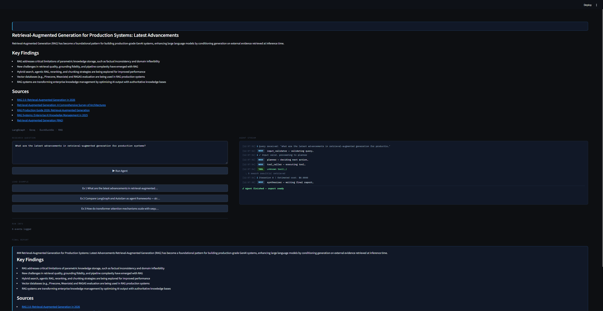

# 🔬 Research Assistant Agent

> A multi-step AI research agent built with LangGraph, Groq, and Streamlit — part of an AI Developer Internship assessment.


---

## What It Does

You type a research question. The agent:

1. **Validates** your input — rejects gibberish, asks for clarification on vague queries
2. **Plans** a search strategy across up to 3 iterations
3. **Searches** the web via DuckDuckGo, scrapes relevant pages, and optionally queries a local RAG knowledge base (Task 1)
4. **Synthesizes** everything into a structured markdown report with citations

All of this happens live — you watch the agent's reasoning step by step in the UI as it runs.

---

## Demo


```
Query: "What are the latest advancements in retrieval-augmented generation for production systems?"

[13:06:25] NODE  input_validator — validating query…
[13:06:25] ℹ  ✓ Input valid, proceeding to planner
[13:06:25] NODE  planner — deciding next action…
[13:06:25] ℹ  Planner selected tool: web_search
[13:06:26] NODE  tool_caller — executing web_search…
[13:06:26] TOOL  web_search(query='…')
           ↳ 6 search results retrieved
[13:06:38] NODE  synthesizer — writing final report…
[13:06:47] ✓ Agent finished — report ready
```

---

## Architecture

```
User Query
    │
    ▼
┌─────────────────┐
│ input_validator │  ── gibberish? → error
│    (Node 1)     │  ── single word? → clarification question
└────────┬────────┘
         │
    ▼
┌─────────────────┐
│    planner      │  ── decides which tool to call next
│    (Node 2)     │  ── stops after 3 iterations or 3 results
└────────┬────────┘
         │
    ▼
┌─────────────────┐
│  tool_caller    │  ── executes the selected tool
│    (Node 3)     │  ── handles failures gracefully
└────────┬────────┘
         │
    ┌────▼────┐
    │  Edge   │  ── enough data? → synthesizer
    │         │  ── cost > $1? → synthesizer
    └────┬────┘  ── else → loop back to planner
         │
    ▼
┌─────────────────┐
│  synthesizer    │  ── calls Groq LLM
│    (Node 4)     │  ── produces structured markdown report
└─────────────────┘
```

---

## Tools

| Tool | Type | Description |
|---|---|---|
| `web_search` | Read | DuckDuckGo search — no API key needed |
| `scrape_page` | Read | Fetches and cleans page content via httpx + BeautifulSoup |
| `query_rag` | Read | Queries the Task 1 FastAPI documentation RAG pipeline |
| `format_report` | Pure | Structures all results into a markdown template for synthesis |

---

## Guardrails

| Condition | Response |
|---|---|
| Gibberish / symbols / no vowels | `error_message` — yellow warning in UI |
| Single-word vague query | `needs_clarification` — asks a specific follow-up |
| Tool raises an exception | Logged to `tool_errors`, agent continues |
| 3 iterations reached | Routes to synthesizer (hard stop) |
| Cost exceeds $1.00 | Routes to synthesizer with cost warning |

---

## Stack

| Component | Choice | Why |
|---|---|---|
| Agent framework | LangGraph 1.2.2 | Explicit state machine, typed edges, built-in recursion limits |
| LLM | Groq + llama-3.3-70b-versatile | Sub-second TTFT, free tier, 128k context |
| Web search | DuckDuckGo (`ddgs`) | No API key, no rate limits at this scale |
| Observability | Langfuse 4.7.1 | Per-node traces, token counts, latency |
| UI | Streamlit 1.58 | Rapid prototyping, native `st.empty()` for live streaming |
| State | TypedDict | Native LangGraph compatibility (Pydantic breaks `.get()`) |

---

## Project Structure

```
task-2/
├── agent.py            # LangGraph graph — nodes, edges, build_graph()
├── agent_state.py      # TypedDict state definition + default_state()
├── agent_tools.py      # 4 tools: web_search, scrape_page, query_rag, format_report
├── app.py              # Streamlit UI with live stream panel
├── decisions.md        # Design decisions and trade-offs
├── guardrail_tests/
│   └── test_guardrails.py   # 18 tests across 3 guardrail classes
└── runs/
    ├── run_1_happy_path.json
    ├── run_2_invalid_input.json
    └── run_3_vague_input.json
```

---

## Getting Started

### Prerequisites

- Python 3.11
- A [Groq API key](https://console.groq.com) (free)
- A [Langfuse](https://langfuse.com) account (free)

### Install dependencies

```bash
pip install langgraph langfuse groq ddgs httpx beautifulsoup4 streamlit python-dotenv
```

### Configure environment

Create `task-2/.env`:

```env
GROQ_API_KEY=your_groq_key_here
LANGFUSE_PUBLIC_KEY=your_langfuse_public_key
LANGFUSE_SECRET_KEY=your_langfuse_secret_key
LANGFUSE_HOST=https://cloud.langfuse.com
```

### Run the app

```bash
cd task-2
python -m streamlit run app.py
```

Open `http://localhost:8501` — type a question or click a preset example.

### Run guardrail tests

```bash
cd task-2
python -m pytest guardrail_tests/ -v
```

All 18 tests should pass.

---

## Observability

Every run is traced in Langfuse:

- `research-agent-run` — top-level agent span
- `node:tool_caller` — per-tool span with arguments and results  
- `final-output` — synthesized report with iteration count

---

## Design Decisions

See [`decisions.md`](decisions.md) for the full write-up. Key choices:

- **TypedDict over Pydantic** — LangGraph calls `.get()` on state internally; Pydantic BaseModel doesn't support this and crashed at runtime
- **Groq over Claude/GPT-4o** — 10–30× cheaper per run, sub-second TTFT makes the live stream feel responsive
- **DuckDuckGo over paid search APIs** — sufficient quality at this scale, zero setup friction
- **Fixed planner over LLM planner** — simpler, faster, easier to test; an LLM-based planner would add latency and cost without meaningful quality improvement for 3-iteration runs

---

## Author

**Syed Nabhan** — AI Developer Intern Assessment  
Built as part of a 3-week technical assessment covering RAG, LangGraph agents, and MCP servers.
