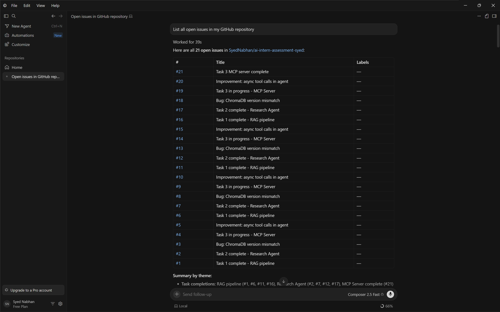

# Task 3 — GitHub Issues MCP Server

A **Model Context Protocol (MCP) server** that gives AI clients (Cursor, MCP Inspector, Claude Desktop) the ability to manage GitHub Issues as native tools. The server runs locally and communicates over **stdio transport** — the AI client launches it as a child process and calls its tools directly.

---

## What It Does




The server exposes 6 tools over MCP:

| Tool | Type | Description |
|---|---|---|
| `list_github_issues` | Read | List open/closed issues with state and labels |
| `get_github_issue` | Read | Fetch full details of a single issue by number |
| `search_github_issues` | Read | Search issues by keyword across title and body |
| `create_github_issue` | **Write** | Create a new issue (requires `confirm=True`) |
| `add_github_comment` | **Write** | Add a comment to an issue (requires `confirm=True`) |
| `apply_github_labels` | **Write** | Apply labels to an issue (requires `confirm=True`) |

Write tools are gated behind a `confirm=True` parameter to prevent accidental mutations when the user only asked a read question.

---

## Project Structure

```
task3/
├── .env                    ← GITHUB_TOKEN + GITHUB_REPO
├── github_client.py        ← httpx wrapper for GitHub REST API
├── server.py               ← FastMCP server with 6 tools
└── create_test_issues.py   ← script to seed test issues
```

---

## Setup

### 1. Clone and navigate

```bash
cd task3
```

### 2. Install dependencies

```bash
pip install mcp httpx python-dotenv
```

### 3. Create `.env`

```env
GITHUB_TOKEN=github_pat_your_token_here
GITHUB_REPO=your-username/your-repo
```

### 4. Get a GitHub Fine-Grained Token

1. Go to **github.com → Settings → Developer settings → Personal access tokens → Fine-grained tokens**
2. Click **Generate new token**
3. Set **Repository access** → Only select repositories → choose your repo
4. Under **Repository permissions**, set **Issues → Read and write**
5. Generate and copy the token into `.env`

### 5. Run the server

```bash
python server.py
```

The server will hang silently — that's correct. It's listening on stdio for an MCP client to connect.

---

## Connecting Clients

### MCP Inspector (for testing)

```bash
npx @modelcontextprotocol/inspector \
  C:\Users\<you>\AppData\Local\Programs\Python\Python311\python.exe \
  path\to\task3\server.py
```

In the Inspector UI:
1. Add environment variables: `GITHUB_TOKEN` and `GITHUB_REPO`
2. Click **Connect**
3. Go to the **Tools** tab to call each tool

### Cursor

Create `~/.cursor/mcp.json` (global) or `.cursor/mcp.json` (project-level):

```json
{
  "mcpServers": {
    "github-issues": {
      "command": "C:\\Users\\<you>\\AppData\\Local\\Programs\\Python\\Python311\\python.exe",
      "args": ["D:\\path\\to\\task3\\server.py"],
      "env": {
        "GITHUB_TOKEN": "your_token_here",
        "GITHUB_REPO": "your-username/your-repo"
      }
    }
  }
}
```

Open Cursor → Settings → MCP → verify `github-issues` shows a green dot. Then open Agent chat (Ctrl+L) and type natural language prompts.

### Claude Desktop

Add to `%APPDATA%\Claude\claude_desktop_config.json`:

```json
{
  "mcpServers": {
    "github-issues": {
      "command": "C:\\Users\\<you>\\AppData\\Local\\Programs\\Python\\Python311\\python.exe",
      "args": ["D:\\path\\to\\task3\\server.py"],
      "env": {
        "GITHUB_TOKEN": "your_token_here",
        "GITHUB_REPO": "your-username/your-repo"
      }
    }
  }
}
```

Note: the hammer icon (🔨) in Claude Desktop requires a Pro plan.

---

## Sample Prompts

Try these in Cursor Agent or any connected MCP client:

```
1. List all open issues in my GitHub repository
2. Search for issues mentioning "RAG" or "retrieval"
3. Get the full details of issue #11
4. Create a new issue titled "Task 3 MCP server complete" — go ahead and confirm
5. Add a comment to issue #11 saying "Verified on Day 11" and confirm it
6. Apply the label "bug" to issue #8 and confirm
```

---

## The `confirm=True` Safety Pattern

Write tools require an explicit `confirm=True` parameter. Without it:

```json
{"error": "confirm=True required to create an issue. Re-call with confirm=True to proceed."}
```

This prevents the AI from accidentally creating issues, posting comments, or modifying labels when the user only asked a read question. The model must receive explicit user intent before any write operation executes.

---

## Tested Clients

| Client | Status |
|---|---|
| MCP Inspector v0.22.0 | ✅ All 6 tools verified |
| Cursor (Composer 2.5) | ✅ All 6 tools verified |
| Claude Desktop | ✅ Server connects (Pro plan required for tool UI) |

---

## Architecture

```
MCP Client (Cursor / Inspector)
        ↓  stdio (stdin/stdout)
    server.py  (FastMCP)
        ├── list_github_issues()
        ├── get_github_issue()
        ├── search_github_issues()
        ├── create_github_issue()     ← confirm=True required
        ├── add_github_comment()      ← confirm=True required
        └── apply_github_labels()     ← confirm=True required
              ↓
        github_client.py  (httpx)
              ↓
        api.github.com
```
