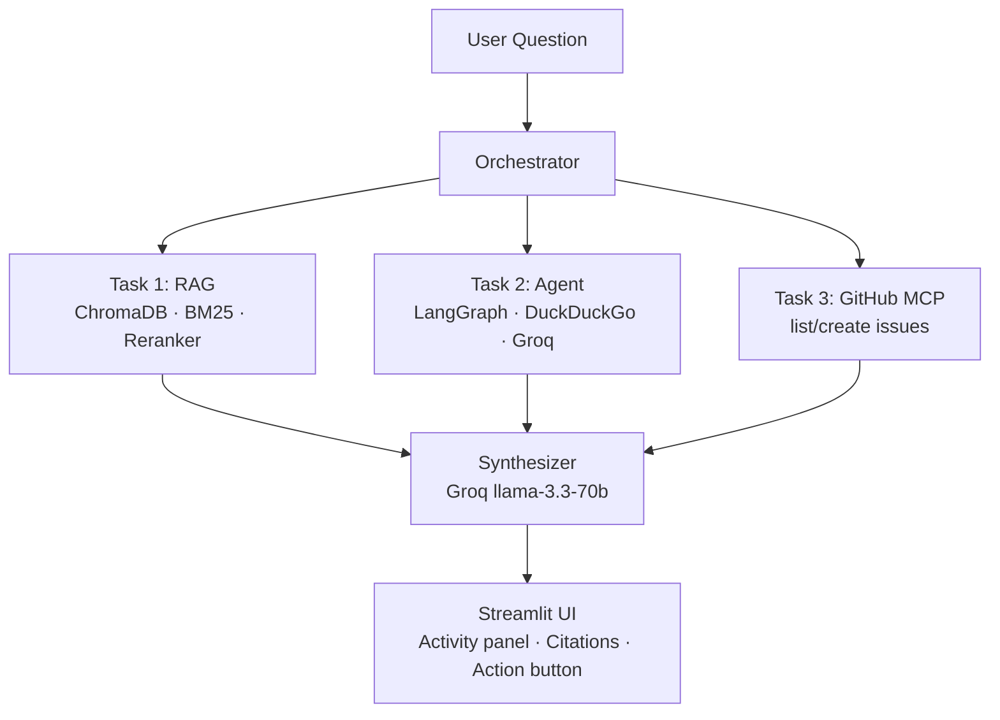

```mermaid
graph TD
    U[User Question] --> O[Orchestrator]
    O --> R[Task 1: RAG\nChromaDB · BM25 · Reranker]
    O --> A[Task 2: Agent\nLangGraph · DuckDuckGo · Groq]
    O --> G[Task 3: GitHub MCP\nlist/create issues]
    R --> S[Synthesizer\nGroq llama-3.3-70b]
    A --> S
    G --> S
    S --> UI[Streamlit UI\nActivity panel · Citations · Action button]
```