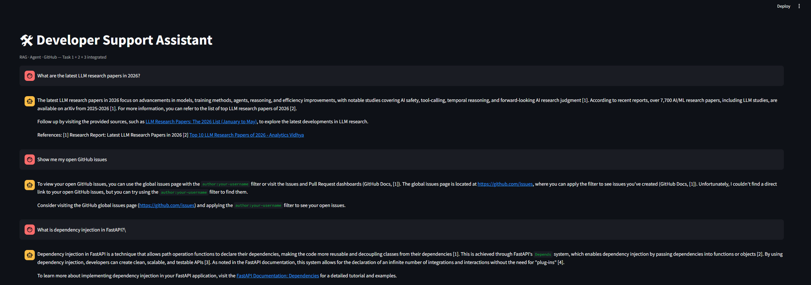

# 🛠 Developer Support Assistant — Capstone

> An integrated AI assistant that combines documentation search, autonomous web research, and GitHub issue management into a single chat interface.  
> Built as the final capstone of a 3-week AI Developer Internship assessment.


---

## What Is This?

This is **Task 4** of a 4-task AI internship assessment. It brings together everything built in the previous three tasks into one unified application:

| Task | What Was Built | Role in Capstone |
|---|---|---|
| Task 1 | RAG pipeline over FastAPI docs | Answers questions from local documentation |
| Task 2 | LangGraph research agent | Searches the web when docs don't have the answer |
| Task 3 | MCP server for GitHub Issues | Reads and creates GitHub issues in real time |
| **Task 4** | **This app — integrates all three** | **Single chat interface over all subsystems** |

---

## How It Works

You type a question. The app runs it through three systems in sequence, then synthesizes everything into one answer:

```
Your Question
      │
      ▼
┌─────────────────────┐
│   Task 1 — RAG      │  Searches 5,172 chunks of FastAPI documentation
│   (ChromaDB)        │  Returns answer + source citations if found
└──────────┬──────────┘
           │
      ▼
┌─────────────────────┐
│   Task 2 — Agent    │  LangGraph agent: plans → searches web → scrapes pages
│   (LangGraph+Groq)  │  Returns a web research report with citations
└──────────┬──────────┘
           │
      ▼
┌─────────────────────┐
│   Task 3 — GitHub   │  Fetches your 3 most recent open issues for context
│   (GitHub REST API) │  Provides live repo context to the synthesizer
└──────────┬──────────┘
           │
      ▼
┌─────────────────────┐
│   Synthesizer       │  Groq LLM combines all three sources
│   (Groq LLM)        │  Writes a single cited answer
└─────────────────────┘
           │
      ▼
  Final Answer + Cost + Latency + "Create GitHub Issue" button
```

Every step is shown **live** in the activity panel as it runs — you don't just see the final answer, you see the reasoning.

---

## What It Looks Like



**Activity panel (live stream):**
```
📚 rag       — Searching documentation...
📚 rag       — RAG: Dependency injection in FastAPI means...
🤖 agent     — Running research agent...
🤖 agent     — Agent node: planner
🤖 agent     — Agent node: tool_caller
🤖 agent     — Agent node: synthesizer
🐙 github    — Checking GitHub issues...
🐙 github    — GitHub: #23: Task 3 MCP server complete...
✍️ synthesizer — Writing final answer...
```

**Final answer:**  
Cited markdown response combining documentation, web research, and repo context.

**Footer:**  
`⏱ 9.6s · 💰 ~$0.0020`

**Action button:**  
`📝 Create GitHub issue from this question`

---

## Project Structure

```
task4/
├── app.py              ← Streamlit UI — chat interface, activity panel, action button
├── orchestrator.py     ← Brain — calls Task 1, 2, 3 in sequence, synthesizes answer
├── .env                ← API keys (never committed)
├── architecture.md     ← Mermaid system diagram
├── LIMITATIONS.md      ← 4 honest limitations ranked by effort to fix
├── decisions.md        ← Design decisions and trade-offs
└── screenshots/
    ├── 01_rag_query.png
    ├── 02_agent_query.png
    ├── 03_github_query.png
    └── 04_out_of_scope.png
```

**Dependencies (other tasks):**
```
ai-intern-assessment-syed/
├── task2/
│   ├── agent.py          ← imported by orchestrator
│   ├── agent_tools.py    ← web_search, scrape_page, query_rag
│   └── task1/            ← RAG pipeline (ChromaDB, BM25, reranker)
└── task3/
    └── github_client.py  ← list_issues, create_issue
```

---

## Getting Started

### Prerequisites

- Python 3.11
- Tasks 1, 2, and 3 already set up in the same repository
- The following API keys:

| Key | Where to get it | Free? |
|---|---|---|
| `GROQ_API_KEY` | [console.groq.com](https://console.groq.com) | ✅ Yes |
| `LANGFUSE_PUBLIC_KEY` | [langfuse.com](https://langfuse.com) | ✅ Yes |
| `LANGFUSE_SECRET_KEY` | [langfuse.com](https://langfuse.com) | ✅ Yes |
| `GITHUB_TOKEN` | [github.com/settings/tokens](https://github.com/settings/tokens) | ✅ Yes |

### 1. Install dependencies

All required packages should already be installed from Tasks 1–3. If starting fresh:

```bash
pip install streamlit langgraph groq langfuse httpx beautifulsoup4 \
            chromadb sentence-transformers rank-bm25 ddgs python-dotenv
```

### 2. Configure environment

Create `task4/.env`:

```env
GROQ_API_KEY=your_groq_key_here
LANGFUSE_PUBLIC_KEY=your_langfuse_public_key
LANGFUSE_SECRET_KEY=your_langfuse_secret_key
LANGFUSE_HOST=https://cloud.langfuse.com
GITHUB_TOKEN=your_github_token_here
GITHUB_REPO=YourUsername/your-repo-name
```

> ⚠️ Never commit `.env` to Git. It's in `.gitignore`.

### 3. Run the app

```bash
cd task4
python -m streamlit run app.py
```

Open `http://localhost:8501` in your browser.

---

## Example Questions to Try

| Question | Which system answers it |
|---|---|
| `What is dependency injection in FastAPI?` | Task 1 RAG (it's in the docs) |
| `What are the latest LLM research papers in 2026?` | Task 2 Agent (web search) |
| `Show me my open GitHub issues` | Task 3 GitHub tool |
| `How does FastAPI handle request validation?` | Task 1 RAG |
| `What is the difference between RAG and fine-tuning?` | Task 2 Agent |

---

## Design Decisions

### Why sequential calls instead of parallel?
Each subsystem's result is independent — RAG, agent, and GitHub don't need each other's output to run. They *could* run in parallel with `asyncio.gather()`, cutting latency by ~60%. Sequential was chosen for simplicity and easier debugging during the assessment. See `LIMITATIONS.md` for the fix.

### Why Groq for synthesis instead of Claude/GPT-4?
Groq's llama-3.3-70b-versatile costs ~$0.002 per full run vs ~$0.10–0.30 on premium APIs. At assessment scale, the quality difference doesn't justify the cost. For production, switching the synthesizer to Claude Sonnet would improve citation accuracy and reasoning quality.

### Why always call all three subsystems?
Simplicity. A smarter router would classify the query first ("is this a docs question? a web question? a GitHub question?") and skip irrelevant subsystems. This would save ~40% of latency on focused questions. Implemented as future improvement.

### Why Streamlit over Next.js?
Streamlit allows `st.status()` and `st.empty()` for live streaming with almost no frontend code. Next.js would give a more polished UI but would add significant frontend complexity for the same core behavior.

---

## Known Limitations

See [`LIMITATIONS.md`](LIMITATIONS.md) for the full list. Summary:

1. **Sequential calls** — RAG, agent, GitHub run one after another. Should be parallel.
2. **No conversation memory** — each question is independent. Follow-ups lose context.
3. **Approximate cost tracking** — token counts are estimated, not read from API responses.
4. **No query routing** — every question hits all three systems even when only one is relevant.

---

## Architecture

See [`architecture.md`](architecture.md) for the full Mermaid diagram.

```
User → Orchestrator → RAG (T1) ─┐
                   → Agent (T2) ─┼→ Groq Synthesizer → Answer
                   → GitHub (T3)─┘
```

---

## The Full Assessment

This capstone is Task 4 of a 4-task assessment:

- **Task 1** — RAG pipeline: chunking, hybrid retrieval, reranker, RAGAS evaluation
- **Task 2** — LangGraph agent: tool use, guardrails, Langfuse observability, Streamlit UI
- **Task 3** — MCP server: FastMCP, GitHub Issues tools, Claude Desktop integration
- **Task 4** — This app: orchestration, streaming UI, cost tracking, integrated action

---

## Author

**Syed Nabhan** — AI Developer Intern Assessment  
3-week technical assessment · June 2026